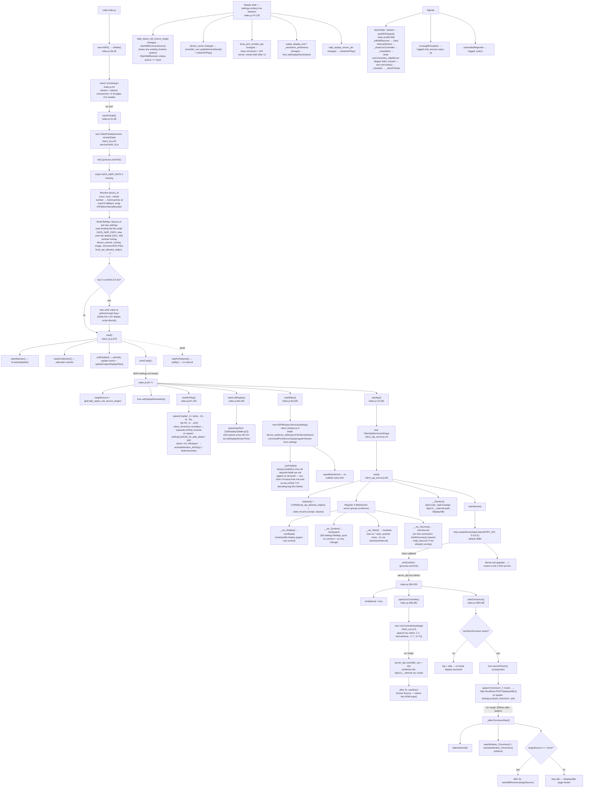

# Client — Startup Process Tree

Traces exactly what happens from process launch (`node index.js`) through
the Client device reaching steady state — connecting NDI/AirPlay input,
CEC, its own local kiosk display, and its Hub-facing sockets. Built by
reading the actual source (not inferred) — see file:line references
throughout.

## Visualization

## Notes on what's *not* pictured / caveats

- **`wsConnection_ndpiServer` / `client-status` push**: earlier versions
  of this Client pushed a `client-status` summary to the Hub over a
  persistent `/ws/client` connection (`clientServer_websocket.js`). That
  entire mechanism was **deleted** (see the Hub's `CLAUDE.md` for the
  full root-cause writeup — it had a `setInterval` leak that re-fired on
  every Hub-hostname/port reconnect). `quitNDPi()`'s shutdown sequence
  still references `index.wsConnection_ndpiServer.close()` — that field
  is never set to anything now, so this line always throws and is
  swallowed by the surrounding `try/catch`; effectively dead code kept
  from the pre-removal shutdown sequence.
- **How the Hub actually learns this device's live status now**: the Hub
  connects *outbound* to this Client's own `/ws/system` and `/ws/stats`
  (started above) — not the other way around — once it knows this
  device's IP/port, either from mDNS discovery or from the one-time
  `/api/v1/adopt` call a Hub makes when an admin adopts this device. That
  adopt call only writes `ndpi_hub_hostname`/`ndpi_hub_port` via
  `client_api_server.js`'s `/api/v1/adopt` route — informational
  bookkeeping only now, since nothing on this Client reads those two
  settings to open a connection anymore.
- **`ndpi_discover` binary**: ARM64 Linux binary; `startDiscovery()`
  spawns it lazily on the *first* `/ws/sources` WebSocket connection, not
  during process startup — not pictured under the main boot sequence for
  that reason, shown as part of `__ws_Sources()`'s connection handler
  instead.
- **NDI receiver (`startNdiReceiver`)**: only actually spawns a process
  when a non-`'none'` source is targeted — either from a previously
  persisted `ndpi_status_ndi_source_target` (fired 5s after Chromium's
  kiosk page loads) or from a later live setting change / Hub command.
  On a fresh device with no source ever selected, no NDI receiver process
  starts at all during boot.
